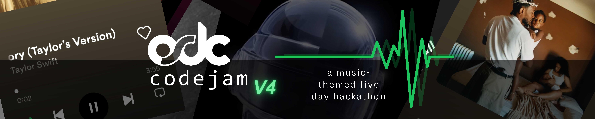

<h1> Welcome to OSDCodeJam-v4!</h1>

## Index
- [What is Code Jam?](#what-is-code-jam)
- [Particulars](#particulars)
- [Timeline](#timeline)
- [Format](#format)
- [Submitting your Project](#submitting-your-project)
- [Daily Quizzes](#daily-quizzes)
- [Rules](#rules)
- [Judging](#judging)

## What is Code Jam?
Codejam is the ultimate test of courage, mental strength and physical durability (jk lol), It is a unique online hackathon where you are paired up with a group of random participants just like yourself with whom you collaborate and make a project on a given theme. You then have around a week's time to create the best project you can. See [Format](#format) for detailed information. This is a joint event organized every year by OSDC and JODC.

## Particulars
- Main Communication Channel: [OSDC Discord]([https://discord.io/osdc](https://discord.com/invite/9m7DhRp3))
- Theme: Give Life Back to Music 🎵
- The winners get Biryani monies + PB&J in prizes!

Well, "Biryani monies" is a recurring slang in the [JODC Discord server]([https://discord.io/jodc](https://discord.gg/Yaq3eNBrwW)) (which is a super fun and lively place to hang out btw) which is used to refer to anyone from the community giving someone a treat. Since this is not a sponsored event, we'd like to give the winners some prize from our own side as appreciation. We will be giving prizes in the form of gift cards.

**NOTE:** This is an online only event. Team members will have to work and collaborate online using discord and other means of communication.

## Timeline
- Registration: 10th January onwards. [Register here](https://docs.google.com/forms/d/e/1FAIpQLSf3_TWrZMaHnlcXnzMO-tPE6ai3TAyM6MLlwO8LAea2I6VUKg/viewform?usp=send_form)
- Opening Ceremony: 12th January 2024
- Teams Announcement: 12th January 2024
- Jamming (Coding Period): 13th - 18th January
- Evaluation 1 : 16th January
- Evaluation 2 : 18th January
- Final Evaluation : 19th January
- Results Announcement: TBD

## Format
- Participants register individually for the Jam, mentioning their technical skills.
- The organizers group the participants in teams of 4 (or 5, depending on the number of registrations) based on their skills and experience to have teams with equal skill levels.
- The organizers announce the teams and theme for the Jam.
- Team members communicate and collaborate to make a project within the 5 days of the Jam that fits their interpretation of the theme. 
- All communications will be through the [OSDC Discord](https://discord.com/invite/9m7DhRp3) Server.
- Teams showcase their ideas during the mid evaluation.
- The project is [submitted to this repo](#submitting-your-project) via a Pull Request.
- The guest judges choose the winners based on the [judging criteria](#judging), which will be announced, and their projects showcased on the Results Meetup.

## Submitting your Project
The submissions for this Jam will be through Pull Requests. Follow these steps to create a PR:

### 1. Fork this repository
Start by [forking this repository.](https://github.com/osdc/codejam-v4/fork) Only one team member needs to do this, the other members can fork that person's fork and work on it.

### 2. Find your team folder in the repository
The repository should already contain a subdirectory named after your team. All your project files must be contained within your team's subdirectory only. If you make any changes to files other than those in your team folder, we will not be able to merge your PR.

If you're using a CI/CD workflow, and require configuration files/folders in the root of the repository, either try to use a unique name (e.g. prefix the configuration files with your team name) or remove the files/directories just before the final submission.

### 3. Create a Pull Request
Only one team member has to do this (The same one who forked this repo directly).
Open a pull request from your fork's main to the main branch of this repository in order to submit your project. You should use the name of your team as the title of the Pull Request. Please open your Pull Request at the start of the Jam (see the next step for clarification).
Avoid opening spam PRs to the repo, and there should be only one PR from each team.

### 4. Keep pushing to your main branch
The Pull Request you created will keep getting updated automatically whenever you push code to main branch on your fork, so you can create the PR whenever you want, and you only have to do it once. You do not need to wait until the very end of the Jam to make the PR and risk missing the deadline. Just keep pushing code to your main branch as you keep progressing, and do your best to finish before the Jam ends!
When working as a team, you should consider learning about feature branches so that you don't all work directly on the main branch and cause each other a bunch of conflicts. For a short explanation of how this works, [see this video.](https://youtube.com/watch?v=j7YDbrS9I48)

## Daily Quizzes 
We will be having a daily quiz on each day during the Jamming Period. It's a fun activity in which all the participants can participate individually. Participation in the quizzes is optional, but we encourage all participants to take part as it is a great way to test your knowledge and skills. The top performers in each quiz will be recognized and rewarded.

## Rules
0. No websites as projects, please.
1. This Jam is only open for JIIT Noida students.
2. The team size requirement is limited to 4-5 members made by OSDC CT members after registration..
3. Any language, library, framework, and open-source code can be used by teams in their work.
4. You must document exactly how to install, configure, and operate your project. This should be as simple as feasible. You can consider using dependency management.
5. All code must be written and committed within the Jam's timeframe. Late commits may be reverted; therefore allow extra time to thoroughly test your programme.
6. You can reuse code from other open source projects as long as you offer proper attribution and obey their LICENSE agreements.
7. Each member of your team needs to contribute, therefore please get in touch with an admin team member if you have a problem with someone on your team. Code is not a prerequisite for these contributions; administration, documentation, graphics, and music are all perfectly acceptable examples. Non-contributing team members will be kicked out of the Code Jam.
8. Teams can gain advice and support from organizers, volunteers, and others.
9. You must use Git as a version control system.
10. Code reviews will be conducted on all projects that the judges have chosen as finalists in order to verify that the code is unique work and that all materials and components adhere to the restrictions permitted by these guidelines.
11. Teams can work on ideas that have already been done. If somebody wants to work on a common idea, they will be allowed to do so and will be judged on the quality of their hack.
12. It is not permitted to work on projects that break the code of conduct.
13. All code and materials must comply with an Open-Source license. This is because your entry will be merged into this repository at the end of the jam.

## Judging
Because programming is full of subtleties and judging is not an exact science, this section will inevitably fall short of being an exact guide for how to win, but it should at least give you an idea of what you should be mindful of as a participant.

- **Code Style:** How easy to read, pleasant to work with, well commented, and self-documenting your code is.
- **README:** How well your README file explains your project, its setup instructions and its features.
- **Uniqueness and Creativity:** In order to level the playing field a bit, we've decided that this is the most important factor. If your idea is an exceptionally good one and you are a beginner, we will cut you some slack on style and execution. It is therefore crucial that you consider what to do more carefully than exactly how to do it.
- **Adherence to Theme:** How uniquely you interpreted the theme and justified it with your idea.
- **Execution:** An important factor is whether your solution is the best solution to the problem you are solving. If your solution is overly convoluted, this will count against you in our evaluation. While the code jam is ongoing, organizers will be available to you for any help or suggestions.
- **Teamwork:** During the Jam, you will be assigned teammates. It is crucial that you find a way to work with your teammates, as we will be evaluating your ability to work as a team. Team members who constantly bicker, complain about each other, or fail to divide up tasks so that everyone can contribute will be penalized when we evaluate the code jam. This does not, however, mean that a team that has a "bad egg" will automatically be unable to win the code-jam. If a team member refuses to play well with the rest of the team or does not participate in the jam, we will usually remove that person from the team and attempt to find a new teammate for the team to replace them.

## Contact
- Social Links: [https://osdc.dev/links/](https://osdc.dev/links/)
